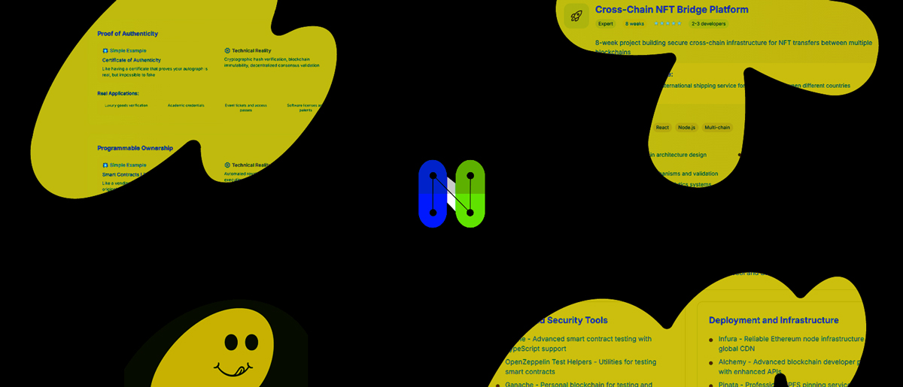

# NFT Education Hub

A lightweight, content-driven Nuxt 3 app that helps newcomers learn about NFTs, wallets, exchanges, blockchains, and tutorials. Built with Nuxt Content and Tailwind CSS.


## Badges

[](https://nuxt.com)
[](https://content.nuxt.com)
[](https://tailwindcss.com)
[](https://www.typescriptlang.org/)
[](https://pnpm.io)


## Screenshot




## Features

- Content-first site using `@nuxt/content` with Markdown in `content/`
- Responsive UI styled with `@nuxtjs/tailwindcss`
- Simple navigation with `TheNavigation` and `BottomNavigation` components
- SEO-ready PWA assets under `public/`
- Fast dev experience with Nuxt 3 and HMR


## Project Structure

- `pages/`: Route-based pages like `index`, `wallets`, `tutorials`, `blockchains`
- `content/`: Markdown content consumed by `@nuxt/content`
- `components/`: Shared UI components
- `assets/css/`: Global styles (Tailwind entry)
- `public/`: Static assets (icons, manifest, social preview)


## Tech Stack

- **Framework**: Nuxt 3
- **Content**: `@nuxt/content`
- **Styling**: Tailwind CSS via `@nuxtjs/tailwindcss`
- **Icons**: `@nuxt/icon` and `@iconify-json/heroicons`
- **Language**: TypeScript-ready configuration


## Getting Started

### Prerequisites
- Node.js 18+
- A package manager: npm, yarn, or pnpm

### Install
```bash
# pnpm (recommended)
pnpm install

# or npm
npm install

# or yarn
yarn install
```

### Development
```bash
# start local dev server at http://localhost:3000
pnpm dev
# or: npm run dev / yarn dev
```

### Build
```bash
pnpm build
# or: npm run build / yarn build
```

### Preview production build
```bash
pnpm preview
# or: npm run preview / yarn preview
```

### Generate static site (optional)
```bash
pnpm generate
# or: npm run generate / yarn generate
```


## How It Works

- Markdown under `content/` is rendered by `@nuxt/content` into pages/components
- Pages in `pages/` define routes; navigation components link between them
- Tailwind is configured via `@nuxtjs/tailwindcss` and `assets/css/main.css`


## Contributing

1. Fork and clone the repo
2. Create a feature branch: `git checkout -b feat/your-feature`
3. Commit your changes: `git commit -m "feat: add your feature"`
4. Push your branch and open a PR


## License

MIT © 2025
